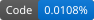
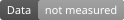
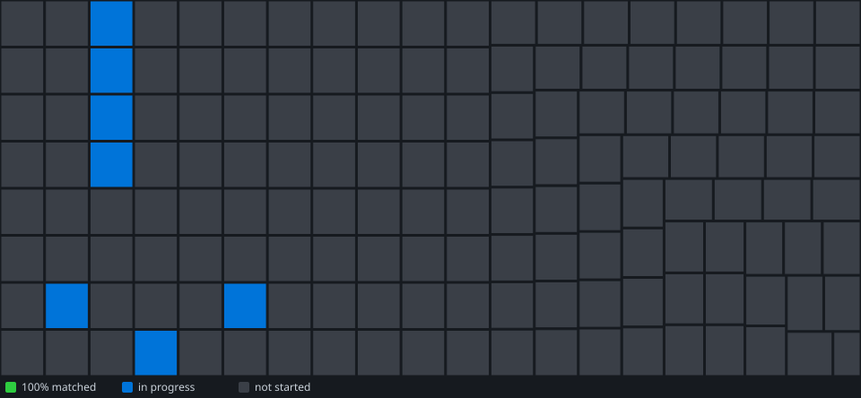

# MKioskDecomp

<!-- badges:start -->
 
<!-- badges:end -->

Analysis notes, symbol tables, verification tools and class-layout headers for a partial reverse-engineering of
`Turbo.rpx`, the Wii U (PowerPC Espresso) executable of Turbo's Kiosk Demo.

## What this repository is and is not

It contains:
- address and symbol tables, with proposed names marked as proposals
- observed structure offsets from decompiler analysis, with the evidence noted
- tools to check a dump against its own CRC table and a reference SHA-256

It does not contain:
- game binaries, assets, textures, sounds or archives
- extracted game data, or decompiled game code
- a matching build. No function bodies are written yet

## Status

Analysis stage. Headers are layout placeholders. Each file says which items are verified and which are not.

## Progress

<!-- progress:start -->

**0.0374% matched** (3,788 of 10,132,008 bytes of code, 19 of about 32,782 functions)

| Library | Code matched | Bytes | Functions | Units done |
| --- | --- | --- | --- | --- |
| Game (Turbo.rpx `.text`) | 0.0374% | 3,788 / 10,132,008 | 19 / 32,782 | 0 / 155 |

Code matched counts bytes of functions whose assembled bytes equal the original. Data is not measured yet.
**Source files:** 8 reconstructions (C++, unmatched), 19 assembly-first files, 3 host tests. Reconstructions are counted separately from matches.
<!-- progress:end -->

## Layout

See `docs/repo_structure.md`. Code conventions (C++, naming, headers, and what counts as matched) are in `docs/conventions.md`.

## Verify your dump

1. Place your copy of `Turbo.rpx` in `orig/`. The folder is git-ignored.
2. Run:

       python tools/rpx_verify.py orig/Turbo.rpx --sha256 4dd6b2122cbb2faeb45c98e161835f36d509e9924347ccf0c1d816c421409c8d

   It prints the SHA-256, checks every section against the file's CRC table and exits non-zero on any mismatch.
3. List the sections with `python tools/rpx_info.py orig/Turbo.rpx`.

The companion `.rpl` hashes are in `config/hashes.txt`.

## License and legal scope

- The original work in this repository (tools, notes, tables, and the layout observations in the headers) is released
  under CC0 1.0 Universal. See `LICENSE`.
- That license covers only what the maintainers own. It does not grant, waive or affect any rights in Nintendo's game
  code, data, assets, names or trademarks. Nothing in this repository gives permission to use them.
- Do not add binaries, assets or extracted game data to the repository. `.gitignore` blocks the common formats.
- This is not legal advice. If you plan to distribute anything derived from this project, check the position first.

## Contributing

Pull requests should contain notes, tools, verified offsets or corrections to existing notes. Do not include raw dumps or
extracted assets. When a claim is inferred rather than verified, say so in the file.
